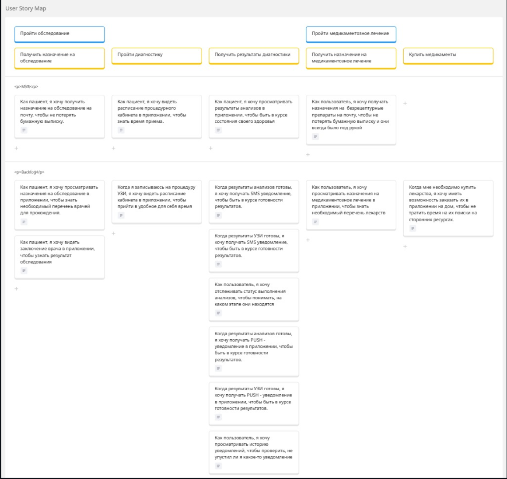
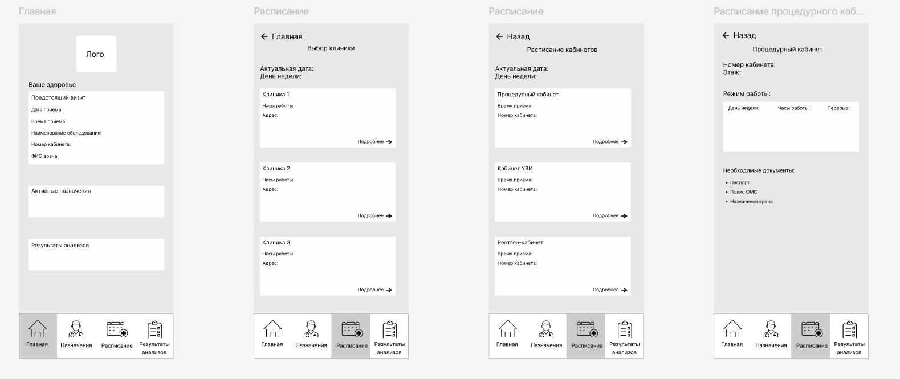
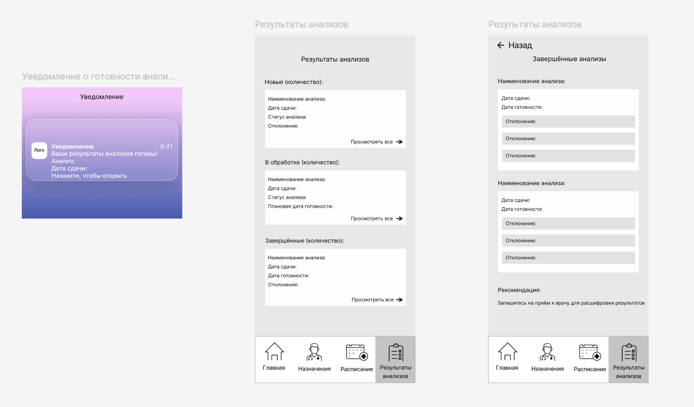
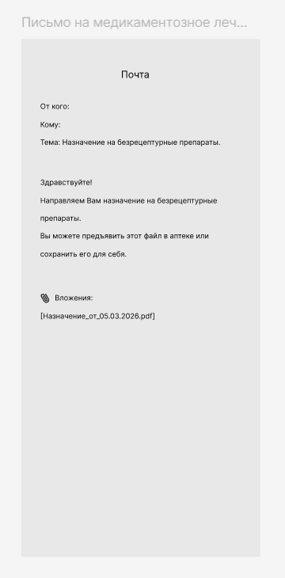
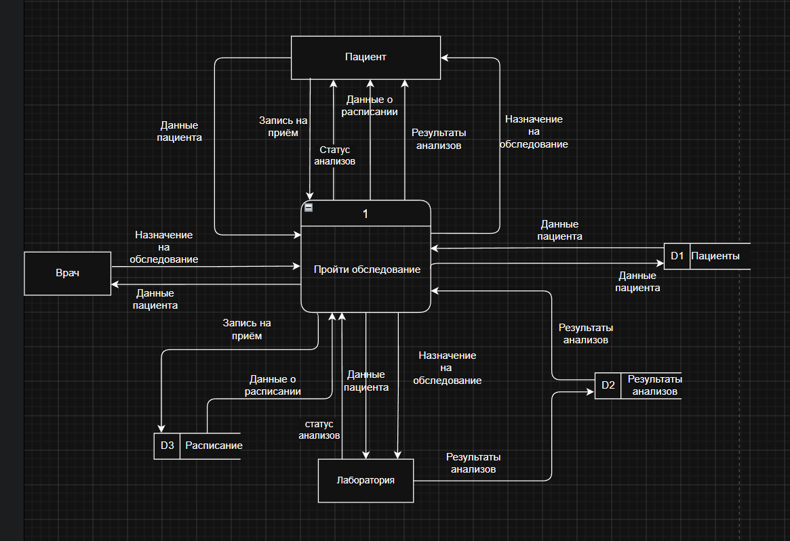
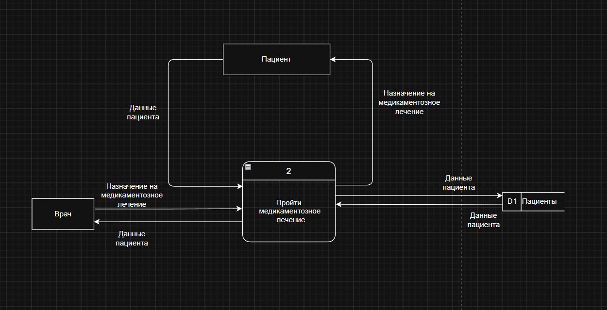

# Анализ требований для мобильного приложения медицинского сервиса «Вита»

## О проекте

Цель проекта — провести полный цикл анализа требований для мобильного приложения медицинского сервиса, позволяющего пациентам получать назначения на обследования и медикаментозное лечение, записываться на прием, просматривать результаты анализов и получать уведомления о готовности исследований.

В рамках проекта были выявлены потребности пользователей, определены основные бизнес-процессы, спроектированы пользовательские сценарии, подготовлены прототипы экранов и модели потоков данных.

---

# Моя роль — Системный аналитик

В рамках проекта я выполнял следующие задачи:

- проведение интервью со стейкхолдерами и выявление бизнес-требований;
- анализ пользовательских потребностей и определение MVP продукта;
- построение карты пользовательских историй (User Story Map);
- формирование и приоритизация пользовательских историй;
- разработка низкоуровневых прототипов экранов приложения;
- моделирование потоков данных (DFD);
- описание взаимодействия внешних участников системы;
- проведение ретроспективы проекта по методике **Start — Stop — Continue**;
- подготовка аналитической документации для передачи команде разработки.

---

# Постановка задачи

При анализе требований необходимо было учесть следующие бизнес-ограничения:

- пользователь получает назначения от врача в электронном виде;
- пациент может просматривать результаты анализов;
- пользователь получает уведомления о готовности исследований;
- назначения на медикаментозное лечение направляются по электронной почте;
- обеспечивается безопасность персональных данных пользователей;
- пользователь получает информацию о стоимости лечения и актуальных ценах.

---

# Артефакты проекта

## User Story Map

После интервью со стейкхолдерами была построена карта пользовательских историй, позволяющая определить пользовательский путь, выделить MVP и приоритизировать функциональность первой версии продукта.

  

---

## Прототипы экранов

На основе пользовательских историй были разработаны wireframe-прототипы основных экранов мобильного приложения.

Они описывают пользовательский сценарий прохождения обследования, просмотра расписания, получения результатов анализов и навигации по приложению.

  

Дополнительно были спроектированы экраны просмотра результатов анализов и push-уведомлений.

  

Также был разработан шаблон электронного письма для отправки назначений на медикаментозное лечение.

  

---

## Контекстная DFD-диаграмма

Для определения взаимодействия системы с внешними участниками была построена контекстная диаграмма потоков данных.

Она отражает обмен информацией между пациентом, врачом, лабораторией и мобильным приложением.

  

---

## DFD уровня 1

Далее контекстная диаграмма была декомпозирована на процессы первого уровня.

Диаграмма описывает процесс прохождения обследования, движение данных между пользователем, лабораторией и внутренними хранилищами данных.

  

Для процесса медикаментозного лечения была разработана отдельная диаграмма потоков данных.

  

---

# Используемые инструменты

- **Miro** — User Story Mapping;
- **Figma** — Wireframes;
- **diagrams.net (draw.io)** — DFD-диаграммы;
- интервью со стейкхолдерами;
- методика **Start — Stop — Continue** для проведения ретроспективы.

---

# Результат проекта

В результате проекта был подготовлен полный комплект аналитических артефактов, необходимых для дальнейшего проектирования и разработки мобильного приложения:

- результаты интервью со стейкхолдерами;
- User Story Map с выделением MVP;
- набор пользовательских историй;
- прототипы экранов мобильного приложения;
- шаблон письма с назначением на медикаментозное лечение;
- контекстная DFD-диаграмма;
- DFD-диаграммы первого уровня;
- рекомендации по развитию продукта, сформированные по итогам ретроспективы.
